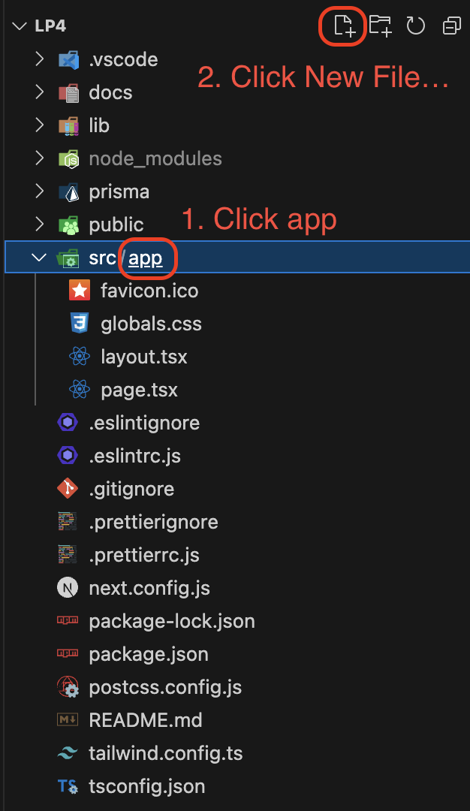
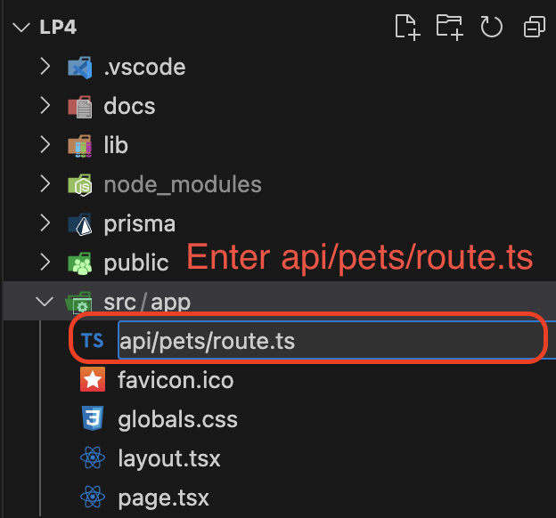
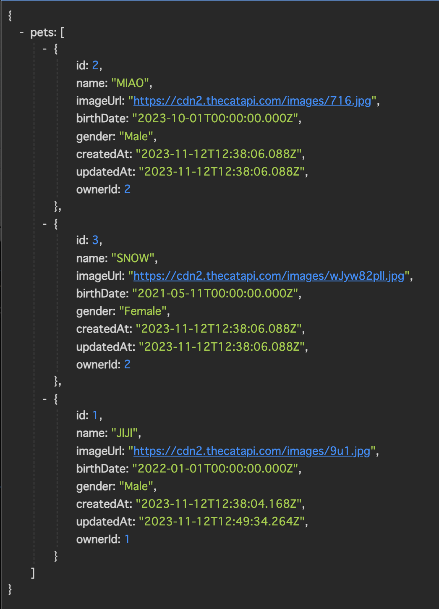

# Experience API Development Basics #2-1

## API implementations

### 1. Designing APIs

**HTTP request methods**

GET:  
The GET method requests a representation of the specified resource. Requests using GET should only retrieve data.

POST:  
The POST method submits an entity to the specified resource, often causing a change in state or side effects on the server.

PUT:  
The PUT method replaces all current representations of the target resource with the request payload.

DELETE:  
The DELETE method deletes the specified resource.

FYI: [HTTP request methods](https://developer.mozilla.org/docs/Web/HTTP/Methods)

**CRUD**

CRUD (Create, Read, Update, Delete) is an acronym for ways one can operate on stored data. It is a mnemonic for the four basic functions of persistent storage. CRUD typically refers to operations performed in a database or datastore, but it can also apply to higher level functions of an application such as soft deletes where data is not actually deleted but marked as deleted via a status.

FYI: [CRUD](https://developer.mozilla.org/docs/Glossary/CRUD)

**Define API operations in terms of HTTP methods**

| Resource | POST(Create)     | GET(Read)                      | PUT(Update)                              | DELETE(Delete)  |
| -------- | ---------------- | ------------------------------ | ---------------------------------------- | --------------- |
| /pets    | Create a new pet | Retrieve all pets              | Bulk update of pets                      | Remove all pets |
| /pets/1  | Error            | Retrieve the details for pet 1 | Update the details of pet 1 if it exists | Remove pet 1    |

### 2. Retrieve all pets

| Resource | GET(Read)         |
| -------- | ----------------- |
| /pets    | Retrieve all pets |

Add file: [`src/app/api/pets/route.ts`](../src/app/api/pets/route.ts)

1. Click app folder
2. Click New File...



1. Enter `api/pets/route.ts`



Created file: [`src/app/api/pets/route.ts`](../src/app/api/pets/route.ts)


like this:

```bash
src
├── app
│   ├── api
│   │   └── pets
│   │   │   └── route.ts
```

Enter the following code to your `route.ts`:

```ts
import { NextResponse } from 'next/server'

import prisma from '../../../../lib/prisma'

// GET /api/pets
export async function GET() {
  const pets = await prisma.pet.findMany()
  return NextResponse.json({ pets })
}
```

> [!TIP]
> Save a file
> | windows | Mac |
> | ------------- | ------------- |
> | `control + s` | `command + s` |

Run the development server:

```bash
npm run dev
```

Open URL: [`http://localhost:3000/api/pets`](http://localhost:3000/api/pets)

Do you see the following data?  
It's difficult to see...


Recommend: [JSONVue](https://chrome.google.com/webstore/detail/jsonvue/chklaanhfefbnpoihckbnefhakgolnmc)

Add the above Chrome extension for better viewing.


Get all pet records:

```json
{
  "pets": [
    {
      "id": 2,
      "name": "MIAO",
      "imageUrl": "https://cdn2.thecatapi.com/images/716.jpg",
      "birthDate": "2023-10-01T00:00:00.000Z",
      "gender": "Male",
      "createdAt": "2023-11-12T12:38:06.088Z",
      "updatedAt": "2023-11-12T12:38:06.088Z",
      "ownerId": 2
    },
    {
      "id": 3,
      "name": "SNOW",
      "imageUrl": "https://cdn2.thecatapi.com/images/wJyw82pIl.jpg",
      "birthDate": "2021-05-11T00:00:00.000Z",
      "gender": "Female",
      "createdAt": "2023-11-12T12:38:06.088Z",
      "updatedAt": "2023-11-12T12:38:06.088Z",
      "ownerId": 2
    },
    {
      "id": 1,
      "name": "JIJI",
      "imageUrl": "https://cdn2.thecatapi.com/images/9u1.jpg",
      "birthDate": "2022-01-01T00:00:00.000Z",
      "gender": "Male",
      "createdAt": "2023-11-12T12:38:04.168Z",
      "updatedAt": "2023-11-12T12:49:34.264Z",
      "ownerId": 1
    }
  ]
}
```

**Explanation of Code**

```ts
import { NextResponse } from 'next/server'

import prisma from '../../../../lib/prisma'

// GET /api/pets
export async function GET() {
  const pets = await prisma.pet.findMany()
  return NextResponse.json({ pets })
}
```

GET method is executed when `/api/pets` is accessed.

```ts
// GET /api/pets
export async function GET() {
  ...
}
```

Retrieve records of the pet table in Database.

```ts
// findMany returns a list of records.
const pets = await prisma.pet.findMany()
```

return Response with pets to json.

```ts
// return Response with pets to json
return NextResponse.json({ pets })
```

> [!NOTE]
> what is JSON?  
> JSON is a text-based data format following JavaScript object syntax, which was popularized by Douglas Crockford. Even though it closely resembles JavaScript object literal syntax, it can be used independently from JavaScript, and many programming environments feature the ability to read (parse) and generate JSON.

FYI: [Working with JSON](https://developer.mozilla.org/docs/Learn/JavaScript/Objects/JSON)

Data acquisition is now available!

**Refactoring of code**

The order is strange.

```json
{
  "pets": [
    {
      "id": 2,
      ...
    },
    {
      "id": 3,
      ...
    },
    {
      "id": 1,
      ...
    }
  ]
}
```

Add sort order

`route.ts` so that it looks like this:

```ts
import { NextResponse } from 'next/server'

import prisma from '../../../../lib/prisma'

// GET /api/pets
export async function GET() {
  // findMany returns a list of records.
  const pets = await prisma.pet.findMany({
    orderBy: { id: 'asc' },
  })
  // return Response with pets to json
  return NextResponse.json({ pets })
}
```

Diff

```diff
import { NextResponse } from 'next/server'

import prisma from '../../../../lib/prisma'

// GET /api/pets
export async function GET() {
  // findMany returns a list of records.
+ const pets = await prisma.pet.findMany({
+   orderBy: { id: 'asc' },
+ })
  // return Response with pets to json
  return NextResponse.json({ pets })
}
```

Sorted in ascending order by id:

```json
{
  "pets": [
    {
      "id": 1,
      "name": "JIJI",
      "imageUrl": "https://cdn2.thecatapi.com/images/9u1.jpg",
      "birthDate": "2022-01-01T00:00:00.000Z",
      "gender": "Male",
      "createdAt": "2023-11-12T12:38:04.168Z",
      "updatedAt": "2023-11-12T12:49:34.264Z",
      "ownerId": 1
    },
    {
      "id": 2,
      "name": "MIAO",
      "imageUrl": "https://cdn2.thecatapi.com/images/716.jpg",
      "birthDate": "2023-10-01T00:00:00.000Z",
      "gender": "Male",
      "createdAt": "2023-11-12T12:38:06.088Z",
      "updatedAt": "2023-11-12T12:38:06.088Z",
      "ownerId": 2
    },
    {
      "id": 3,
      "name": "SNOW",
      "imageUrl": "https://cdn2.thecatapi.com/images/wJyw82pIl.jpg",
      "birthDate": "2021-05-11T00:00:00.000Z",
      "gender": "Female",
      "createdAt": "2023-11-12T12:38:06.088Z",
      "updatedAt": "2023-11-12T12:38:06.088Z",
      "ownerId": 2
    }
  ]
}
```

**Explanation of Code**

Use orderBy to sort a list of records or a nested list of records by a particular field or set of fields.  
For example, the following query returns all pet records sorted by id:

```ts
const pets = await prisma.pet.findMany({
  // sort by id ascending
  orderBy: { id: 'asc' },
})
```

| Note:  |                            |
| ------ | -------------------------- |
| `asc`  | `asc` is ascending order   |
| `desc` | `desc` is decreasing order |

### Exercise

Try it in descending order and see what happens.

**Refactoring of code**

`ownerId: x`  
It is difficult to know who the owner

```json
{
  "pets": [
    {
      "id": 2,
      ...
      ownerId: 1
    },
    {
      "id": 3,
      ...
      ownerId: 2
    },
    {
      "id": 1,
      ...
      ownerId: 2
    }
  ]
}
```

Add get owner data

`route.ts` so that it looks like this:

```ts
import { NextResponse } from 'next/server'

import prisma from '../../../../lib/prisma'

// GET /api/pets
export async function GET() {
  // findMany returns a list of records.
  const pets = await prisma.pet.findMany({
    // sort by id ascending
    orderBy: { id: 'asc' },
    include: { owner: true },
  })
  // return Response with pets to json
  return NextResponse.json({ pets })
}
```

Diff

```diff
import { NextResponse } from 'next/server'

import prisma from '../../../../lib/prisma'

// GET /api/pets
export async function GET() {
  // findMany returns a list of records.
  const pets = await prisma.pet.findMany({
    // sort by id ascending
    orderBy: { id: 'asc' },
+   include: { owner: true },
  })
  // return Response with pets to json
  return NextResponse.json({ pets })
}
```

Added Owner information:

```json
{
  "pets": [
    {
      "id": 1,
      "name": "JIJI",
      "imageUrl": "https://cdn2.thecatapi.com/images/9u1.jpg",
      "birthDate": "2022-01-01T00:00:00.000Z",
      "gender": "Male",
      "createdAt": "2023-11-12T12:38:04.168Z",
      "updatedAt": "2023-11-12T12:49:34.264Z",
      "ownerId": 1,
      "owner": {
        "id": 1,
        "email": "alice@pbc.io",
        "name": "Alice",
        "createdAt": "2023-11-12T12:38:04.168Z",
        "updatedAt": "2023-11-12T12:38:04.168Z"
      }
    },
    {
      "id": 2,
      "name": "MIAO",
      "imageUrl": "https://cdn2.thecatapi.com/images/716.jpg",
      "birthDate": "2023-10-01T00:00:00.000Z",
      "gender": "Male",
      "createdAt": "2023-11-12T12:38:06.088Z",
      "updatedAt": "2023-11-12T12:38:06.088Z",
      "ownerId": 2,
      "owner": {
        "id": 2,
        "email": "bob@pbc.io",
        "name": "Bob2",
        "createdAt": "2023-11-12T12:38:06.088Z",
        "updatedAt": "2023-11-12T12:38:06.088Z"
      }
    },
    {
      "id": 3,
      "name": "SNOW",
      "imageUrl": "https://cdn2.thecatapi.com/images/wJyw82pIl.jpg",
      "birthDate": "2021-05-11T00:00:00.000Z",
      "gender": "Female",
      "createdAt": "2023-11-12T12:38:06.088Z",
      "updatedAt": "2023-11-12T12:38:06.088Z",
      "ownerId": 2,
      "owner": {
        "id": 2,
        "email": "bob@pbc.io",
        "name": "Bob2",
        "createdAt": "2023-11-12T12:38:06.088Z",
        "updatedAt": "2023-11-12T12:38:06.088Z"
      }
    }
  ]
}
```

Easier to understand!

**Explanation of Code**

Nested reads allow you to read related data from multiple tables in your database.  
The following example returns a pet and its owner:

```ts
const pets = await prisma.pet.findMany({
  // sort by id ascending
  orderBy: { id: 'asc' },
  // include owner data
  include: { owner: true },
})
```

Finally, retrieve only the data you need

`route.ts` so that it looks like this:

```ts
export async function GET() {
  const pets = await prisma.pet.findMany({
    // sort by id ascending
    orderBy: { id: 'asc' },
    select: { id: true, name: true, imageUrl: true, owner: { select: { name: true } } },
  })
  // return Response with pets to json
  return NextResponse.json({ pets })
}
```

Diff

> [!NOTE]
> Some lines have been deleted.

```diff
export async function GET() {
  const pets = await prisma.pet.findMany({
    // sort by id ascending
    orderBy: { id: 'asc' },
-   // include owner data
-   include: { owner: true },
+   select: { id: true, name: true, imageUrl: true, owner: { select: { name: true } } },
  })
  // return Response with pets to json
  return NextResponse.json({ pets })
}
```

Just the data you need.

```json
{
  "pets": [
    {
      "id": 1,
      "name": "JIJI",
      "imageUrl": "https://cdn2.thecatapi.com/images/9u1.jpg",
      "owner": {
        "name": "Alice"
      }
    },
    {
      "id": 2,
      "name": "MIAO",
      "imageUrl": "https://cdn2.thecatapi.com/images/716.jpg",
      "owner": {
        "name": "Bob2"
      }
    },
    {
      "id": 3,
      "name": "SNOW",
      "imageUrl": "https://cdn2.thecatapi.com/images/wJyw82pIl.jpg",
      "owner": {
        "name": "Bob2"
      }
    }
  ]
}
```

**Why did you delete it?**

It's a duplication of process, so it's an error.


**Explanation of Code**

Specify only the data you need.
Simplify by not acquiring unnecessary data.

```ts
const pets = await prisma.pet.findMany({
  // sort by id ascending
  orderBy: { id: 'asc' },
  // select only id, name, imageUrl, and owner.name
  select: { id: true, name: true, imageUrl: true, owner: { select: { name: true } } },
})
```

### Exercise

Try to change it to the data you want.

### 3. Retrieve the details for pet

| Resource | GET(Read)                      |
| -------- | ------------------------------ |
| /pet/1   | Retrieve the details for pet 1 |

Add file: [`src/app/api/pets/[id]/route.ts`](../src/app/api/pets/[id]/route.ts)

1. Click pets folder
2. Click New File...
3. Enter `[id]/route.ts`

Created file: [`src/app/api/pets/[id]/route.ts`](../src/app/api/pets/[id]/route.ts)

like this:

```bash
src
├── app
│   ├── api
│   │   └── pets
│   │       ├── [id]
│   │       │   └── route.ts
│   │       └── route.ts
```

Enter the following code to your `route.ts`:

```ts
import { NextResponse } from 'next/server'

import prisma from '../../../../../lib/prisma'

// GET /api/pets/:id
export async function GET(request: Request, { params }: { params: { id: string } }) {
  // get id from params
  const id = params.id
  // findUnique returns a single pet with owner data
  const pet = await prisma.pet.findUnique({
    // where id is equal to the id param
    where: { id: Number(id) },
    // include owner data
    include: { owner: true },
  })
  // return Response with pets to json
  return NextResponse.json({ pet })
}
```

Open URL: [`http://localhost:3000/api/pets/1`](http://localhost:3000/api/pets/1)

Get the pet record with an id of 1:

```json
{
  "pet": {
    "id": 1,
    "name": "JIJI",
    "imageUrl": "https://cdn2.thecatapi.com/images/9u1.jpg",
    "birthDate": "2022-01-01T00:00:00.000Z",
    "gender": "Male",
    "createdAt": "2023-11-12T12:38:04.168Z",
    "updatedAt": "2023-11-12T12:49:34.264Z",
    "ownerId": 1,
    "owner": {
      "id": 1,
      "email": "alice@pbc.io",
      "name": "Alice",
      "createdAt": "2023-11-12T12:38:04.168Z",
      "updatedAt": "2023-11-12T12:38:04.168Z"
    }
  }
}
```

**Explanation of Code**

A Dynamic Segment can be created by wrapping a folder's name in square brackets: `[folderName]`.  
For example, `[id]` or `[slug]`.

Dynamic Segments are passed as the `params` prop.

| Route                        | Example URL   | params        |
| ---------------------------- | ------------- | ------------- |
| `app/api/pets/[id]/route.ts` | `/api/pets/1` | `{ id: '1' }` |
| `app/api/pets/[id]/route.ts` | `/api/pets/2` | `{ id: '2' }` |
| `app/api/pets/[id]/route.ts` | `/api/pets/3` | `{ id: '3' }` |

A pet could include the following route `app/api/pets/[id]/route.ts` where `[id]` is the Dynamic Segment for pet info.

```ts
// GET /api/pets/:id
export async function GET(request: Request, { params }: { params: { id: string } }) {
  ...
}
```

`findMany` to `findUnique` to get only one data

```ts
// findUnique returns a single pet with owner data
const pet = await prisma.pet.findUnique({
  ...
})
```

### Exercise

Try to get data by name.

### 4. Summary of GET methods

**`findMany`**

`findMany` returns a list of records.

---

**`findUnique`**

`findUnique` query lets you retrieve a single database record:

- By ID
- By a unique attribute

---

Next [`Experience API Development Basics #2-2`](./2-experience-api-development-3.md)
